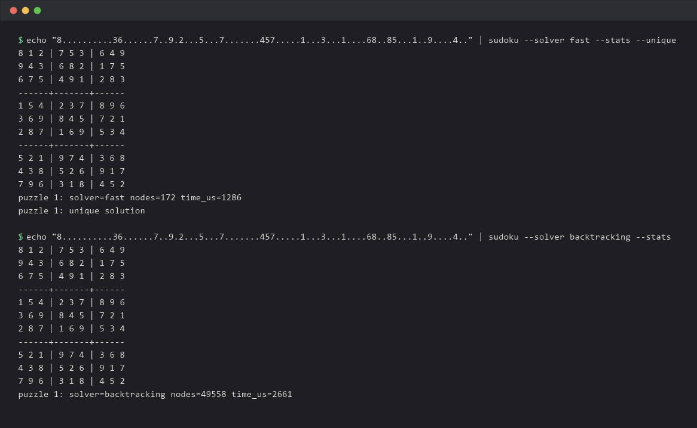

# Sudoku Solver

[](https://github.com/Raaif-Yousuf/Sudoku-Solver/actions/workflows/ci.yml)

A C++17 Sudoku solver. I started with a plain backtracking solver, then wrote a second one using bitmasks and constraint propagation to see how much faster it could get. On Norvig's 95 hard puzzles it went from 30.1 s to 52 ms.



## How it works

The backtracking solver fills cells left to right, tries 1 to 9, and backs up on a clash. The fast solver changes three things:

- Each row, column and box keeps a 9-bit mask of used digits, so a cell's candidates are one bit operation.
- Before branching it fills every cell that has only one option, and every digit that fits in only one place.
- When it has to guess, it picks the cell with the fewest candidates.

`--unique` counts solutions to check that a puzzle has exactly one.

## Results

Mean of 3 runs on my laptop (Core Ultra 7 255H, GCC 16.1.0, -O3). Puzzle sets are from [Norvig's essay](https://norvig.com/sudoku.html). Raw output in `docs/benchmark-2026-09.txt`.

| Puzzle set | Backtracking | Fast | Placements tried (avg) |
|---|---|---|---|
| easy50 | 118 ms | 1.8 ms | 24,493 → 0.6 |
| top95 | 30.1 s | 52 ms | 4,138,390 → 64.5 |
| hardest | 106 ms | 1.4 ms | 95,454 → 9 |

Wall-clock totals swing by 1.5-2x between back to back runs on this laptop (turbo and background load), so treat these as ballpark; the node counts above are exact and identical every run.

It isn't always faster. Norvig's `hard1` has many solutions, so propagation rarely prunes anything: over three runs the fast solver averaged 1.6 s on it where backtracking averaged 30 ms.

## Build

```bash
cmake -S . -B build -DCMAKE_BUILD_TYPE=Release
cmake --build build --config Release
./build/sudoku puzzle.txt
ctest --test-dir build -C Release
```

If you only want to run it, the [v1.0.0 release](https://github.com/Raaif-Yousuf/Sudoku-Solver/releases/tag/v1.0.0)
has a standalone Windows x64 binary with no runtime dependencies.

Needs CMake 3.16+ and a C++17 compiler. Puzzles can be 81-character lines (`.` or `0` for blanks) or 9 rows of digits. To rerun the benchmark, `python scripts/download_puzzles.py` then `./build/bench/sudoku_bench bench/data/*.txt`.

The 79 GoogleTest tests run on Linux, Windows and macOS for every pull request, plus a sanitizer build.

## License

MIT
